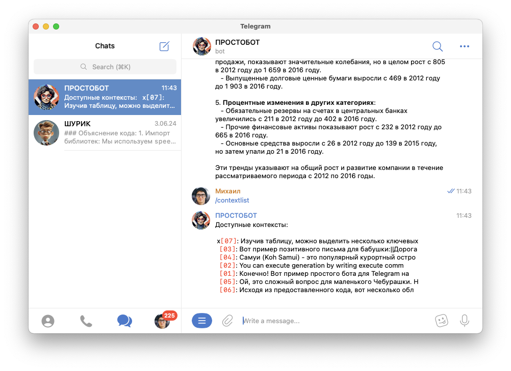
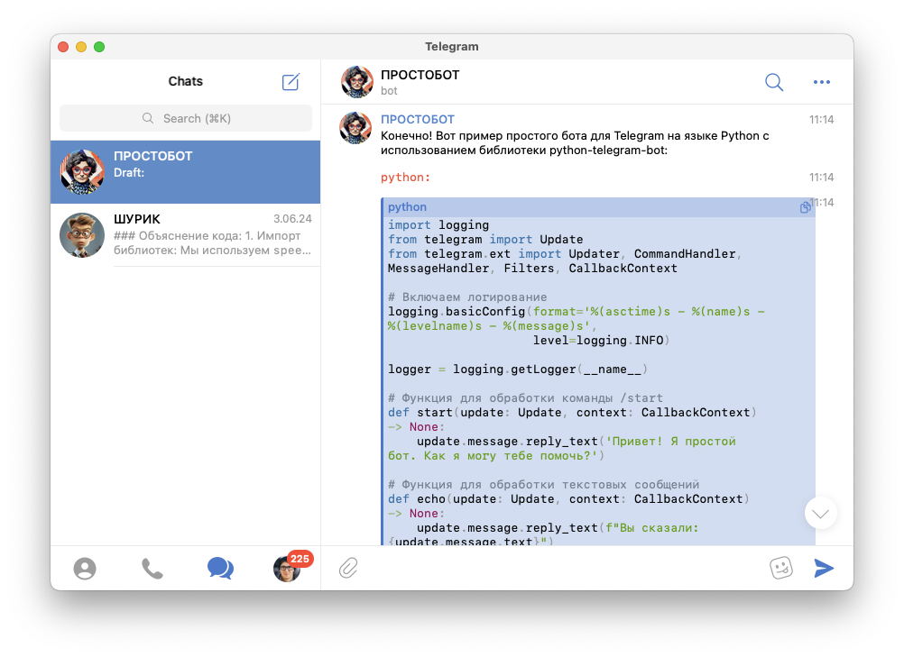
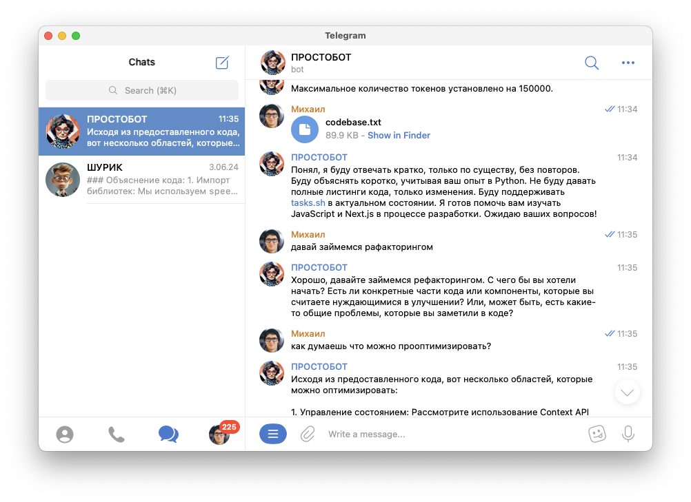
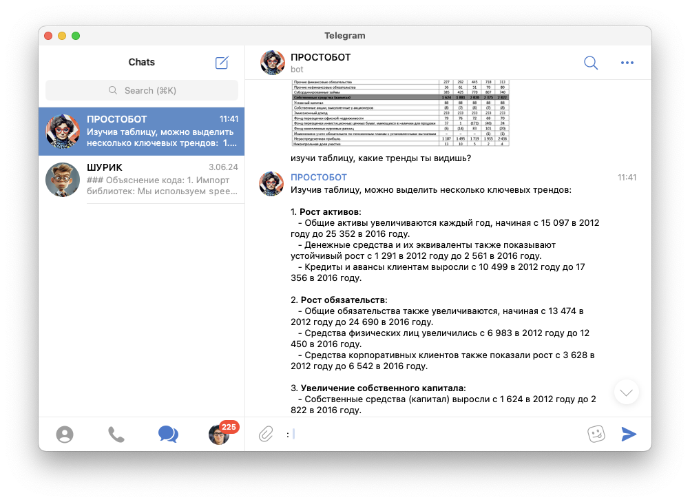
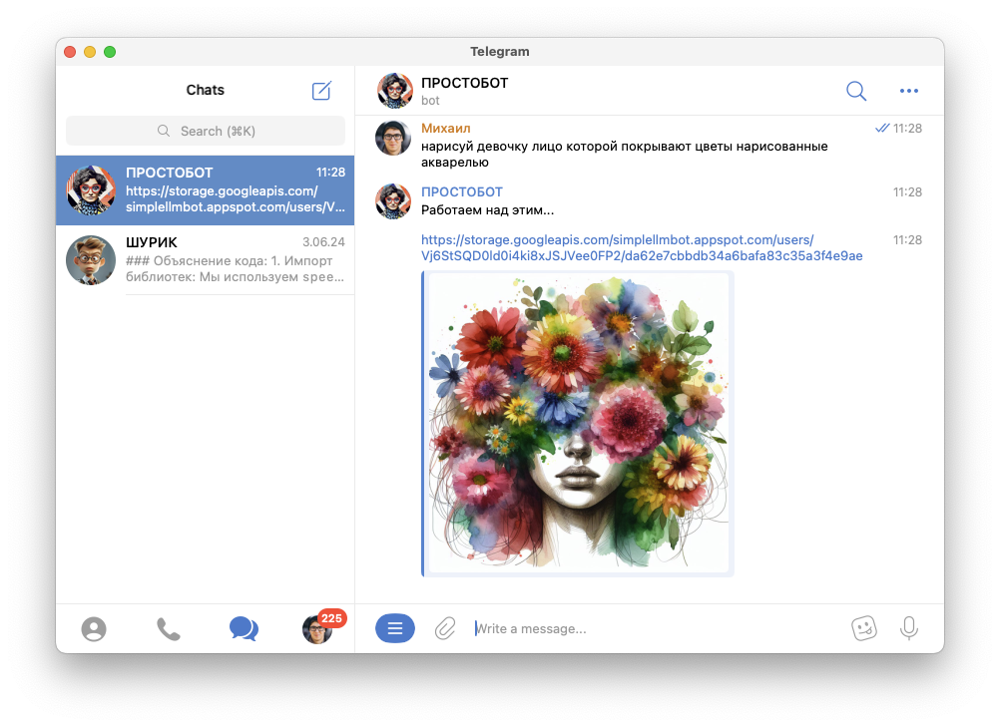

# Полное руководство пользователя BiznesBot

## Содержание
1. Введение
2. Начало работы
3. Основные команды
4. Работа с контекстами
5. Модели
6. Использование инструкций
7. Применение в маркетинге
8. Применение в HR
9. Применение в программировании
10. Применение в дизайне
11. Дополнительные функции

## 1. Введение

[BiznesBot](https://biznesbot.ai/) — это мощный инструмент на базе искусственного интеллекта, разработанный специально для помощи в различных бизнес-задачах. Он использует передовые языковые модели, такие как GPT-4 и Claude, чтобы обеспечить интеллектуальную поддержку в разных аспектах вашей работы. О различных кейсах использования языковых моделей искусственного интеллекта вы можете почитать на [моём канале про AI](https://t.me/sergiobulaev). Также функции BiznesBot можно бесплатно опробовать в [ПРОСТОБОТЕ](https://t.me/simplellmbot).

## 2. Начало работы

Для начала работы с ботом выполните следующие шаги:

1. Найдите бота в Telegram: @your_biznesbot_name
2. Отправьте команду `/start`
3. Следуйте инструкциям для регистрации, используя вашу рабочую электронную почту

Пример:

```
Вы: /start
Бот: Добро пожаловать в BiznesBot! Пожалуйста, отправьте ваш email для регистрации.
Вы: your.name@company.com
Бот: Пожалуйста, проверьте вашу почту и введите код подтверждения.
Вы: 123456
Бот: Вы успешно зарегистрированы!
```

## 3. Основные команды

- `/help` - показать список доступных команд
- `/status` - показать текущие настройки бота
- `/model [название_модели]` - выбрать модель ИИ
- `/temp [значение]` - установить температуру генерации (от 0 до 1)
- `/maxtokens [число]` - установить максимальное количество токенов
- `/answer [число]` - установить максимальную длину ответа
- `/i [описание]` - сгенерировать изображение
- `/speech` - включить/выключить генерацию речи
- `/speech [голос]` - выбрать голос для генерации речи

## 4. Работа с контекстами

Контексты в BiznesBot позволяют вам сохранять и переключаться между разными темами общения, не теряя истории разговора. Это особенно полезно, если вы работаете над несколькими проектами одновременно и хотите, чтобы бот помнил информацию, относящуюся к каждому проекту, или же наоборот у вас есть повторяющией задачи и вы не хотите каждый раз объяснять боту всё сначала.

### Как это работает

BiznesBot использует механизм контекстов для запоминания истории разговоров в рамках каждого проекта или задачи. Каждый раз когда вы отправляете сообщение боту, вместе с ним отправляется часть истории вашей переписки. Это и называется контекст. Это делает взаимодействие с ботом более эффективным, так как он может помнить предыдущие обсуждения, детали и ваши запросы, не требуя повторного объяснения.

**Размер отправляемого контекста напрямую влияет на стоимость запроса к боту**

### Создание и переключение контекстов

Чтобы создать новый контекст используйте команду:

`/contextn new`

Вы можете легко переключаться между разными контекстами с помощью команды `/context [номер]`. Вот пример:

```
Вы: /context list
Бот: Доступные контексты:
     [01]: Разработка лендинга для клиента А
     [02]: SMM стратегия для клиента Б
     [03]: Дизайн логотипа для клиента В

Вы: /context 2
Бот: Переключено на контекст [02]. Как я могу помочь с SMM стратегией для клиента Б?
```

### Очистка контекста
Если вам нужно начать обсуждение с "нуля" и не использовать прошлую историю, вы можете очистить текущий контекст командой `/flushcontext`. Эта команда удалит всю информацию, которая была сохранена в этом контексте, и бот начнёт работу с вами как с новым запросом, без учёта предыдущих разговоров.

```
Вы: /flushcontext
Бот: Текущий контекст очищен. Готов начать с нового запроса!
```

### Управление размкерами контекста:

Команды `/maxtokens` и `/answer` позволяют вам контролировать объем обрабатываемой и генерируемой информации. Они индивидуальны для каждого контекста. Разные модели имеют разные возможности максимального контекста.

#### Максимальное количество токенов (`/maxtokens`)
Токены - это базовые единицы текста, которые обрабатывает ИИ. Установка максимального количества токенов определяет, сколько информации из истории вашего общения бот может учитывать в контексте разговора.

```
Вы: /maxtokens 2000
Бот: Максимальное количество токенов установлено на 2000.
```

Зачем это нужно:

- Контроль объема обрабатываемой информации
- Оптимизация скорости работы бота
- **Управление расходами на использование ИИ**

#### Максимальная длина ответа (`/answer`)
Эта настройка определяет, насколько длинными могут быть ответы бота.

```
Вы: /answer 500
Бот: Максимальная длина ответа установлена на 500 токенов.
```

Зачем это нужно:

- Получение более кратких или развернутых ответов
- Адаптация ответов под конкретные задачи
- Экономия времени на чтение при необходимости


### Пример использования контекстов:

```
Вы: /context list
Бот: Доступные контексты:
     [01]: Разработка лендинга для клиента А
     [02]: SMM стратегия для клиента Б
     [03]: Дизайн логотипа для клиента В

Вы: /context 2
Бот: Переключено на контекст [02]. Как я могу помочь с SMM стратегией для клиента Б?

Вы: Давай обсудим идеи для постов в Instagram
Бот: Отлично! Вот несколько идей для постов в Instagram для клиента Б...

Вы: /context 3
Бот: Переключено на контекст [03]. Возвращаемся к обсуждению дизайна логотипа для клиента В.
```



## 5. Модели

BiznesBot использует несколько продвинутых языковых моделей, каждая из которых подходит для разных типов задач. Вы можете переключаться между моделями с помощью команды `/model [название_модели]`. Вот краткое описание доступных моделей:

- `gpt-4`: Наиболее мощная модель от OpenAI, идеальна для сложных задач и глубокого анализа текста. Контекст до 8000 токенов.
- `gpt-4o`: Оптимизированная версия GPT-4, более быстрая и менее ресурсоёмкая. Контекст до 128000 токенов.
- `gpt-3.5-turbo`: Быстрая и эффективная версия GPT-3.5, идеально подходит для повседневных задач. Контекст до 4000 токенов.
- `gpt-3.5-turbo-16k`: Увеличенная версия GPT-3.5-Turbo с контекстным окном до 16k токенов.
- `claude-opus`: Мощная модель от Anthropic, ориентированная на безопасность и выполнение сложных задач. Контекст до 200000 токенов.
- `claude-sonnet`: Оптимизированная и эффективная версия модели Claude (версия 3.5). Контекст до 200000 токенов.
- `claude-haiku`: Лёгкая версия модели Claude, предназначенная для быстрых и простых запросов. Контекст до 200000 токенов.

## 6. Использование инструкций

Команда `/instruct` позволяет вам задать специфические инструкции для бота, определяя его роль и способ ответов. Индивидуальны для каждого контекста.

- `/instruct [инструкция]` - установить новую инструкцию
- `/instruct reset` - сбросить инструкцию к стандартной

Пример использования инструкций:

```
Вы: /instruct Ты - опытный маркетолог, специализирующийся на B2B-секторе. Твои ответы должны быть краткими и ориентированными на практическое применение.

Бот: Инструкция принята. Теперь я буду отвечать как опытный B2B-маркетолог с фокусом на практические решения.

Вы: Как нам улучшить воронку продаж для нашего нового SaaS-продукта?

Бот: 1. Оптимизируйте лендинг: чёткое УТП, кейсы, призыв к действию.
2. Внедрите лид-магнит: бесплатный пробный период или white paper.
3. Настройте email-воронку с обучающим контентом.
4. Используйте ретаргетинг для незавершивших регистрацию.
5. Предложите демо-звонок с экспертом для теплых лидов.
```

## 7. Применение в маркетинге

BiznesBot может помочь вам в различных маркетинговых задачах:

- Генерация идей для контента
- Анализ конкурентов
- Разработка маркетинговых стратегий
- Создание рекламных текстов

Пример использования для маркетинга:

```
Вы: Давай разработаем план контента для Instagram-аккаунта веб-студии на неделю

Бот: Конечно! Вот план контента на неделю для Instagram-аккаунта веб-студии:

1. Понедельник: Обучающий пост о трендах веб-дизайна 2024 года
2. Вторник: Кейс-стори успешного проекта (до/после + результаты)
3. Среда: Закулисье процесса разработки (фото/видео команды за работой)
4. Четверг: Полезный совет по SEO-оптимизации сайта
5. Пятница: Интерактивный опрос об используемых CMS
6. Суббота: Знакомство с членом команды (мини-интервью)
7. Воскресенье: Мотивационная цитата о важности качественного веб-присутствия

Не забудьте использовать релевантные хэштеги и геотеги к каждому посту!
```

## 8. Применение в HR

Бот может помочь в различных HR-задачах:

- Составление описаний вакансий
- Разработка вопросов для собеседований
- Анализ резюме кандидатов
- Создание планов обучения сотрудников

Пример использования в HR:

```
Вы: Составь список вопросов для собеседования на позицию Frontend-разработчика

Бот: Вот список вопросов для собеседования Frontend-разработчика:

1. Расскажите о вашем опыте работы с современными JavaScript-фреймворками (React, Vue, Angular).
2. Как вы подходите к оптимизации производительности веб-приложений?
3. Объясните принцип работы CSS Flexbox и Grid. В каких ситуациях вы бы использовали каждый из них?
4. Как вы обеспечиваете кроссбраузерную совместимость ваших проектов?
5. Расскажите о вашем опыте работы с системами контроля версий (Git).
6. Как вы подходите к написанию чистого и поддерживаемого кода?
7. Опишите ваш опыт работы с API и асинхронными запросами.
8. Как вы тестируете свой код? Какие инструменты используете?
9. Расскажите о вашем самом сложном проекте. С какими трудностями вы столкнулись и как их преодолели?
10. Как вы поддерживаете свои знания в актуальном состоянии в быстро меняющейся сфере фронтенд-разработки?

Эти вопросы помогут оценить технические навыки, опыт и подход к работе кандидата.
```

## 9. Применение в программировании

BiznesBot может помочь программистам в различных задачах:

- Объяснение концепций и алгоритмов
- Отладка кода
- Генерация шаблонов кода
- Рекомендации по оптимизации

Пример использования в программировании:

```
Вы: Объясни, как работает алгоритм быстрой сортировки (QuickSort) и напиши его реализацию на JavaScript

Бот: Конечно! Давайте разберем алгоритм быстрой сортировки (QuickSort) и его реализацию на JavaScript.

Принцип работы QuickSort:
1. Выбирается опорный элемент из массива (обычно последний).
2. Массив разделяется на два подмассива: элементы меньше опорного и больше опорного.
3. Рекурсивно применяется тот же алгоритм к обоим подмассивам.
4. Соединяются отсортированные подмассивы и опорный элемент.

Вот реализация на JavaScript:
```

```javascript
function quickSort(arr) {
  if (arr.length <= 1) {
    return arr;
  }

  const pivot = arr[arr.length - 1];
  const left = [];
  const right = [];

  for (let i = 0; i < arr.length - 1; i++) {
    if (arr[i] < pivot) {
      left.push(arr[i]);
    } else {
      right.push(arr[i]);
    }
  }

  return [...quickSort(left), pivot, ...quickSort(right)];
}

// Пример использования
const unsortedArray = [64, 34, 25, 12, 22, 11, 90];
console.log(quickSort(unsortedArray));
```


```
Этот алгоритм эффективен для больших наборов данных и имеет среднюю сложность O(n log n). Однако в худшем случае (когда массив уже отсортирован) сложность может достигать O(n^2).
```



## 10. Применение в дизайне

Бот может помогать в различных аспектах дизайна:

- Генерация идей для дизайна
- Подбор цветовых палитр
- Рекомендации по типографике
- Анализ трендов в дизайне

Пример использования в дизайне:

```
Вы: Предложи современную цветовую палитру для сайта финтех-стартапа

Бот: Для финтех-стартапа я предлагаю современную и надежную цветовую палитру:

1. Основной цвет: #3498db (яркий синий)
   - Символизирует доверие, стабильность и профессионализм
   
2. Акцентный цвет: #2ecc71 (свежий зеленый)
   - Ассоциируется с ростом, финансами и позитивными изменениями
   
3. Нейтральный цвет: #ecf0f1 (светло-серый)
   - Создает чистый и современный фон
   
4. Темный цвет: #2c3e50 (темно-синий)
   - Для текста и элементов, требующих контраста
   
5. Цвет предупреждения: #e74c3c (мягкий красный)
   - Для уведомлений и важных сообщений

Эта палитра сочетает в себе профессионализм (синий), рост (зеленый) и современный вид (нейтральные тона). Она хорошо подходит для финансовых интерфейсов, обеспечивая читаемость и приятный визуальный опыт.

Совет: Используйте основной синий для главных элементов интерфейса, зеленый для кнопок призыва к действию, а нейтральные тона для фона и второстепенных элементов.
```

## 11. Дополнительные функции

### 11.1 Работа с файлами и медиа

#### Текстовые файлы
Вы можете отправлять боту текстовые файлы, и он обработает их содержимое как обычное сообщение. Это полезно для обхода ограничения Telegram на длину сообщений в 4000 символов.

Пример использования:

```
Вы: Я сейчас отправлю тебе большое сообщение, содержащеее кодовую базу моего проекта. Предложи рекомендации по рефакторингу основных классов.
Бот: Понял, жду кодовую базу.
Вы: [отправляете файл "codebase.txt"]
Бот: Я проанализировал ваш проект и вот мои рекомендации...
```



#### Работа с изображениями
Для анализа изображений отправьте фото боту вместе с инструкцией, что нужно сделать.

Пример:

```
Вы: [отправляете фото логотипа] Проанализируй этот логотип и предложи улучшения
Бот: Я проанализировал отправленный логотип. Вот мои наблюдения и предложения по улучшению:
1. Текущий дизайн: минималистичный логотип с использованием синего и белого цветов...
2. Предложения по улучшению:
   - Увеличьте контраст между фоном и текстом для лучшей читаемости
   - Рассмотрите возможность добавления простого графического элемента...
```



#### Обработка голосовых сообщений
При отправке голосового сообщения бот автоматически преобразует его в текст и использует как запрос.

Пример:

```
Вы: [отправляете голосовое сообщение "Составь план контент-маркетинга на следующий месяц"]
Бот: Я понял ваш запрос. Вот план контент-маркетинга на следующий месяц:
1. Неделя 1: Серия постов о преимуществах нашего продукта
2. Неделя 2: Интервью с экспертом отрасли
...
```

#### Генерация изображений
Используйте команду `/i [описание]` для создания изображений на основе текстового описания.

Пример:

```
Вы: /i Создай логотип для кофейни в стиле минимализм
Бот: [Генерирует и отправляет изображение]
Вот логотип для кофейни в минималистичном стиле. Если вы хотите внести изменения, пожалуйста, опишите их.
```



### 11.2 Генерация речи

Бот может преобразовывать свои текстовые ответы в аудиоформат.

Для включения/выключения этой функции используйте команду:

```
Вы: /speech
Бот: Генерация речи включена.

Вы: Расскажи о преимуществах контент-маркетинга
Бот: [Отправляет текстовое и аудиосообщение с ответом]
```

Чтобы выбрать голос для аудиосообщений, используйте:

```
Вы: /speech alloy
Бот: Голос для генерации речи установлен на alloy.
```

Доступные голоса: `alloy`, `echo`, `fable`, `onyx`, `nova`, `shimmer`.


## Заключение

BiznesBot - это мощный и гибкий инструмент, способный значительно повысить эффективность вашей работы в сферах маркетинга, HR, программирования и дизайна. Ключ к его эффективному использованию - экспериментирование с различными функциями и настройками.

Не стесняйтесь задавать боту вопросы о его возможностях или просить помощи в освоении новых функций. Помните, что бот постоянно обучается и улучшается, поэтому регулярно проверяйте обновления и новые возможности.

Успехов в работе с BiznesBot!

Связаться со мной можно в Telegram: [@SergeOnSamui](https://t.me/sergeonsamui)

(c) Sergey Bulaev, 2024